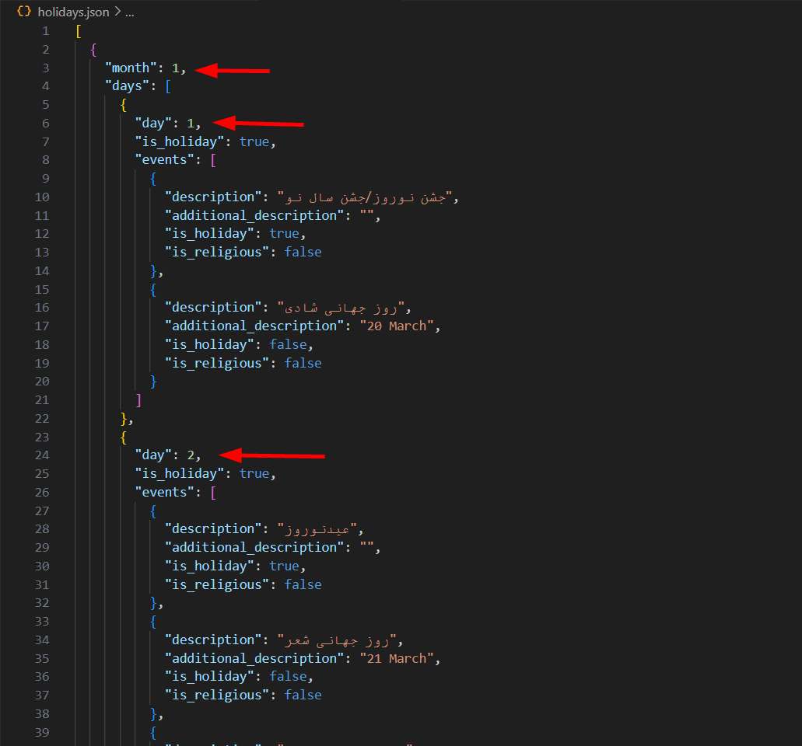

# Holidays Crawler
Source Code: [Crawler JS](index.js)

توضیحات:

این کد برای تمام روزهای سال به سرویس مربوطه ریکوئست میزند و در صورت تعطیل بودن، دیتا مورد نظر را ذخیره کرده و در نهایت در فایل `holidays.json` دخیره میکند.

## Result
JSON File: [File link](holidays.json)

